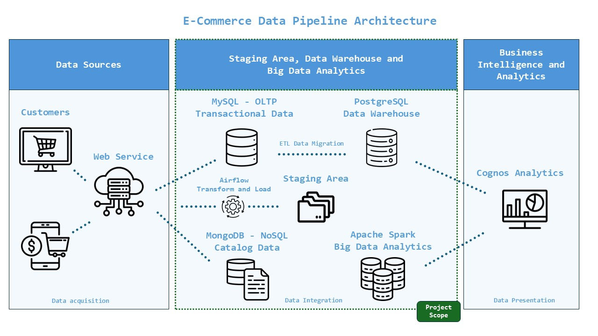

# E-Commerce Data Platform

This Data Platform is inspired by the IBM Data Engineering Capstone Project on Coursera. While it follows the core objectives of the course, the key enhancement is **full Dockerization**, making it easier to simulate a real-world e-commerce data platform.



This project is intentionally designed as a **data engineering platform** rather than a fully connected **data movement pipeline**. Each module operates independently to **simulate different aspects of data engineering workflows**—from OLTP databases to big data analytics—within a unified environment. As a result, **data is not interconnected between modules**.  

This modular approach makes the platform a **strong foundation for future data engineering projects**, enabling **flexible experimentation, scalable expansion, and seamless integration of new components** as needed. 

---

## **Project Overview**

The goal is to build a fully functional **data pipeline** that includes:

- [OLTP MySQL database](./oltp/) for transactional data
- [NoSQL MongoDB database](./nosql/) for product catalog storage
- [Data Warehouse (DWH)](./data-warehouse/) for analytical queries
- ETL pipelines for [data migration](./data-migration-etl/) and [web service analytics](./airflow-etl/)
- [Big Data Analytics](./bigdata/) using Apache Spark ML

All modules are **Dockerized**, making it easy to run and develop within an isolated environment.

---

## **Technology Used**  

### **Databases:**  
- **MySQL** – OLTP (Transactional) database  
- **PostgreSQL** – Data Warehouse for analytical queries
- **MongoDB** – NoSQL database for product catalog    

### **Data Processing & ETL:**  
- **Python** – Data transformation and ETL scripting  
- **Apache Spark** – Big Data analytics and ML model implementation  
- **Apache Airflow** – Workflow orchestration for automated data pipelines

### **Dashboarding & Business Intelligence:**  
- **IBM Cognos Analytics** – Used for visualizing reports and dashboards.  
  - While **Cognos dashboards can be created**, they are not included in this repository since **the main focus is working with data locally** and Cognos does not require Docker.  
  - However, the **data from this project can be used for BI dashboards** by connecting Cognos to the data warehouse.  

### **Infrastructure & Tools:**  
- **Docker & Docker Compose** – Containerized environments for each module 
- **Linux / Shell Scripting** – Automating tasks  
- **Jupyter Notebooks** – Exploratory Data Analysis  
- **VS Code / PyCharm** – Development environments  

---

## **Setup & Installation**

### **1️ - Prerequisites**
- [Docker](https://docs.docker.com/get-docker/)
- [Docker Compose](https://docs.docker.com/compose/install/)
- Python 3.x (if running scripts locally)

### **2 - Clone the Repository**
```sh
git clone https://github.com/yourusername/ecommerce-data-platform.git
cd ecommerce-data-platform
```

### **3 - Run Individual Modules**
Each module contains additional instructions, but the main idea is to start a specific module by navigating to its folder and running:
```sh
docker-compose up -d
```

---

Here’s the corrected **Possible Issues** section with improved clarity and formatting:

---

### **Possible Issues & Troubleshooting**  

#### **Shell Script Permission Issues**  
Before running `.sh` scripts, ensure they have execution permissions:  
```sh
chmod +x script_name.sh
```

---

### **Acknowledgments**  
This project is based on the [IBM Data Engineering Capstone Project](https://www.coursera.org/learn/data-enginering-capstone-project) from Coursera. Special thanks to the course authors for providing the structure and datasets used in this implementation.  

> **Note:** All data provided in this project comes from Coursera and is used solely for educational purposes.