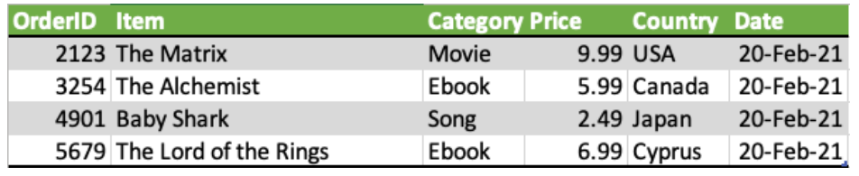
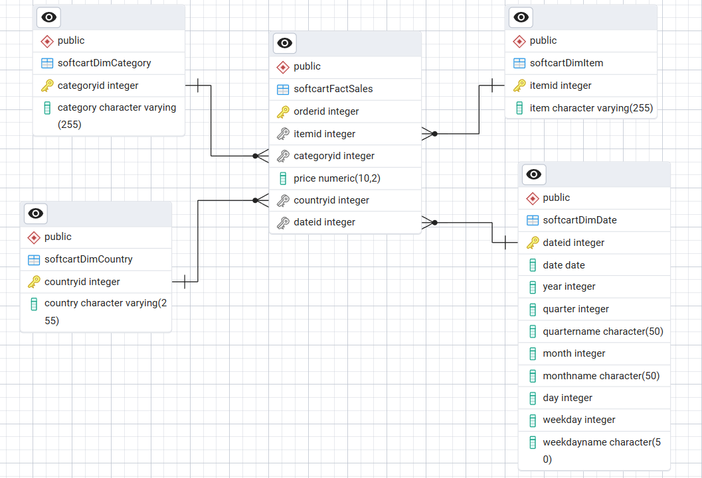

# Data Warehouse Module for E-Commerce Data Platform

## Overview
This module involves designing and implementing a **data warehouse** for an e-commerce company. The goal is to enable reporting and analytics for business insights.

---

## **Project Scenario**

### **Part 1: Data Warehouse Schema Design**
The objective is to build a data warehouse that supports reports such as:
- **Total sales per year per country**
- **Total sales per month per category**
- **Total sales per quarter per country**
- **Total sales per category per country**

The schema is based on the following data snippet:



#### **Steps to Set Up the Schema**
1. **Start PostgreSQL & PGAdmin4** using Docker:
   ```sh
   docker-compose up -d
   ```
2. **Load the star schema** into PostgreSQL:
   ```sh
   ./import_schema_staging.sh
   ```

    SQL code for the star schema is available [here](./schema/star_schema_generated.sql). 

3. **Explore the star schema**: 

    .

---

### **Part 2: Schema Optimization & Data Analysis**
Schema from part 1 has been reviewed by a **senior data engineer** and updated to meet **production standards**. Now, the task is to:
- Load [the new schema](./schema/CREATE-SCRIPT.sql)
- Import data from [CSV files](./data/)
- Generate reports from the data warehouse

#### **Steps to Set Up the Optimized Schema & Data**
1. **Load the new schema**:
   ```sh
   ./import_schema_test1.sh
   ```
2. **Import data into the data warehouse**:
   ```sh
   ./import_data_test1.sh
   ```
3. **Explore & Analyze Data**:
   - Use **queries from** [Analytics Queries](./data/analytics_queries.sql) to generate reports.
   - Connect to PostgreSQL:
     ```sh
     ./connect_psql.sh
     ```

